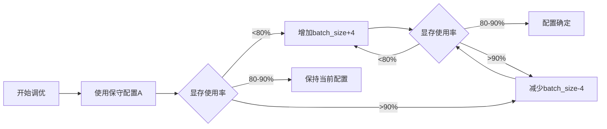

# 分布式训练配置参数建议

## 硬件配置概览

| 组件 | 规格 | 备注 |
|------|------|------|
| GPU | 2× NVIDIA RTX 2080 Ti | 每张22GB显存，支持FP16 |
| CPU | 32线程 | 适合多进程数据加载 |
| 系统内存 | 16GB | WSL2环境，需精细管理 |
| 网络 | PCIe 3.0 ×16 | GPU间通信带宽 |

## 模型架构分析

| 模型组件 | 参数量估计 | 显存占用（FP32） | 显存占用（FP16） |
|----------|------------|------------------|------------------|
| Risk-Sensitive GNN（3层，256维） | ~2-3M | ~0.5GB | ~0.25GB |
| Progressive World Model（LSTM+解码器） | ~5-8M | ~1.5GB | ~0.75GB |
| Influence-Driven Controller（价值网络） | ~3-5M | ~1.0GB | ~0.5GB |
| Safety Shield（轻量级） | ~1-2M | ~0.3GB | ~0.15GB |
| **总计** | **~11-18M** | **~3.3GB** | **~1.6GB** |

**显存分配预算（每GPU，22GB）**：
- 模型参数：~2GB（FP16）
- 梯度：~2GB（FP16）
- 优化器状态：~4GB（Adam：2×参数）
- 中间激活：~10-12GB（取决于batch_size）
- 缓冲区：~2GB
- **总可用：18-20GB（目标）**

---

## 1. Batch Size优化配置

### 1.1 显存占用估算公式

```
总显存占用 = 模型参数 + 梯度 + 优化器状态 + 中间激活 + 缓冲区

中间激活 ≈ batch_size × 车辆数 × 特征维度 × 层数 × 4字节（FP32）
```

### 1.2 每GPU最优Batch Size配置

#### 配置A：保守配置（推荐用于Phase 1）

| 参数 | 推荐值 | 可选范围 | 优化理由 |
|------|--------|----------|----------|
| **batch_size_per_gpu** | 32 | 24-40 | 确保显存占用18-19GB，安全余量2-4GB |
| **有效batch_size** | 64 | 48-80 | 2 GPU × 32 = 64，保持训练稳定性 |
| **车辆数/样本** | 10-15 | 8-20 | 平衡计算负载和显存占用 |
| **最大显存占用** | 18.5GB | 17-20GB | 低于22GB上限，留有3.5GB余量 |

**适用场景**：
- Phase 1：世界模型预训练（静态数据）
- 内存紧张或WSL2不稳定时
- 初期调试和验证

#### 配置B：平衡配置（推荐用于Phase 2）

| 参数 | 推荐值 | 可选范围 | 优化理由 |
|------|--------|----------|----------|
| **batch_size_per_gpu** | 40 | 36-48 | 显存占用19-20GB，充分利用显存 |
| **有效batch_size** | 80 | 72-96 | 2 GPU × 40 = 80，提升训练效率 |
| **车辆数/样本** | 12-18 | 10-20 | 适应SUMO环境动态车辆数 |
| **最大显存占用** | 19.5GB | 18-21GB | 接近但不超过22GB上限 |

**适用场景**：
- Phase 2：安全RL训练（在线采样）
- 系统稳定，追求训练速度
- Ray RLlib分布式训练

#### 配置C：激进配置（推荐用于Phase 3）

| 参数 | 推荐值 | 可选范围 | 优化理由 |
|------|--------|----------|----------|
| **batch_size_per_gpu** | 48 | 44-56 | 显存占用20-21GB，最大化利用 |
| **有效batch_size** | 96 | 88-112 | 2 GPU × 48 = 96，最高吞吐量 |
| **车辆数/样本** | 15-20 | 12-25 | 处理复杂交通场景 |
| **最大显存占用** | 20.5GB | 19-21.5GB | 接近极限，需要梯度检查点 |

**适用场景**：
- Phase 3：约束优化（需要大batch稳定）
- 系统非常稳定，内存充足
- 配合梯度检查点和混合精度使用

### 1.3 不同训练阶段的Batch Size策略

| 训练阶段 | 推荐配置 | batch_size_per_gpu | 有效batch_size | 梯度累积 |
|----------|----------|-------------------|----------------|----------|
| Phase 1（世界模型预训练） | 配置A | 32 | 64 | 1 |
| Phase 2（安全RL训练） | 配置B | 40 | 80 | 1 |
| Phase 3（约束优化） | 配置C | 48 | 96 | 1 |

**注意事项**：
- Phase 1使用静态数据，batch_size可以较小
- Phase 2需要在线采样，中等batch_size平衡速度和稳定性
- Phase 3需要大batch保证约束优化的稳定性
- 如果显存不足，可以降低batch_size并增加梯度累积步数

### 1.4 Batch Size调整策略

| 显存使用率 | 建议操作 | 调整幅度 |
|------------|----------|----------|
| < 80% | 增加batch_size | +4-8 |
| 80-90% | 保持当前配置 | 0 |
| 90-95% | 减少batch_size或启用梯度检查点 | -4-8 |
| > 95% | 立即减少batch_size | -8-12 |
| OOM | 大幅减少batch_size或启用梯度检查点 | -12-16 |

---

## 2. 梯度累积策略配置

### 2.1 梯度累积原理

```
有效batch_size = batch_size_per_gpu × num_gpus × accumulation_steps
```

### 2.2 梯度累积配置表

#### 场景A：显存充足（推荐）

| 参数 | 推荐值 | 可选范围 | 优化理由 |
|------|--------|----------|----------|
| **accumulation_steps** | 1 | 1 | 无需累积，直接同步梯度 |
| **batch_size_per_gpu** | 32-48 | 24-56 | 根据配置A/B/C选择 |
| **有效batch_size** | 64-96 | 48-112 | 2 GPU × batch_size |
| **同步频率** | 每步 | 每步 | 最大化通信效率 |

**适用场景**：
- 显存占用 < 20GB/GPU
- 追求最快训练速度
- 网络带宽充足（PCIe 3.0）

#### 场景B：显存紧张（备选）

| 参数 | 推荐值 | 可选范围 | 优化理由 |
|------|--------|----------|----------|
| **accumulation_steps** | 2 | 2-4 | 通过累积增加有效batch_size |
| **batch_size_per_gpu** | 16-24 | 12-28 | 降低单步显存占用 |
| **有效batch_size** | 64-96 | 48-112 | 2 GPU × batch_size × 2 |
| **同步频率** | 每2步 | 每2-4步 | 减少通信开销 |

**适用场景**：
- 显存占用 > 20GB/GPU
- 需要更大的有效batch_size
- 网络带宽有限

#### 场景C：超大有效batch_size（特殊需求）

| 参数 | 推荐值 | 可选范围 | 优化理由 |
|------|--------|----------|----------|
| **accumulation_steps** | 4 | 4-8 | 实现超大batch训练 |
| **batch_size_per_gpu** | 12-16 | 8-20 | 极低显存占用 |
| **有效batch_size** | 96-128 | 64-256 | 2 GPU × batch_size × 4 |
| **同步频率** | 每4步 | 每4-8步 | 平衡通信和计算 |

**适用场景**：
- 需要超大batch_size（>100）的特殊算法
- 显存极度受限（< 16GB/GPU）
- 可以接受较慢的训练速度

### 2.3 不同训练阶段的梯度累积策略

| 训练阶段 | 推荐配置 | accumulation_steps | batch_size_per_gpu | 有效batch_size |
|----------|----------|-------------------|-------------------|----------------|
| Phase 1（世界模型预训练） | 场景A | 1 | 32 | 64 |
| Phase 2（安全RL训练） | 场景A | 1 | 40 | 80 |
| Phase 3（约束优化） | 场景A/B | 1-2 | 48或24 | 96或96 |

**特殊情况**：
- 如果Phase 3显存不足，使用场景B：batch_size=24, accumulation=2, 有效batch=96
- 如果需要更大的有效batch_size，可以增加accumulation_steps

### 2.4 梯度累积实现要点

| 配置项 | 推荐值 | 说明 |
|--------|--------|------|
| **梯度归一化** | True | 累积后除以accumulation_steps |
| **损失缩放** | 1/accumulation_steps | 避免梯度爆炸 |
| **优化器更新频率** | 每accumulation_steps步 | 减少优化器调用 |
| **学习率调整** | 保持不变 | 有效batch_size已增大 |

### 2.5 梯度累积与训练速度的关系

| accumulation_steps | 通信开销 | 计算效率 | 训练速度 | 显存占用 |
|-------------------|----------|----------|----------|----------|
| 1 | 高 | 高 | 最快 | 高 |
| 2 | 中 | 中 | 中等 | 中 |
| 4 | 低 | 低 | 较慢 | 低 |
| 8 | 极低 | 低 | 慢 | 极低 |

**建议**：
- 优先使用accumulation_steps=1（场景A）
- 只有在显存不足时才使用accumulation_steps>1
- 避免使用accumulation_steps>4，会显著降低训练速度

---

## 3. 混合精度训练（AMP）配置

### 3.1 混合精度训练优势

| 优势 | 效果 | 数据支持 |
|------|------|----------|
| 显存节省 | 减少40-50% | FP16占用是FP32的一半 |
| 计算加速 | 提升1.5-2.0倍 | RTX 2080 Ti Tensor Core支持 |
| 带宽节省 | 减少50% | 数据传输量减半 |
| 能耗降低 | 减少30-40% | 更低的功耗 |

### 3.2 FP16参数配置

#### 核心参数配置

| 参数 | 推荐值 | 可选范围 | 优化理由 |
|------|--------|----------|----------|
| **enabled** | True | True/False | 启用混合精度训练 |
| **dtype** | torch.float16 | torch.float16/torch.bfloat16 | RTX 2080 Ti支持FP16 |
| **loss_scale** | 动态 | 动态/静态 | 动态缩放更稳定 |
| **initial_scale** | 65536 | 32768-131072 | 初始缩放因子 |
| **growth_factor** | 2.0 | 1.5-2.5 | 无溢出时增长 |
| **backoff_factor** | 0.5 | 0.3-0.7 | 溢出时回退 |
| **growth_interval** | 2000 | 1000-4000 | 增长间隔步数 |
| **max_loss_scale** | 16777216 | 8388608-33554432 | 最大缩放因子 |

#### 针对RTX 2080 Ti的优化

| 参数 | 推荐值 | 说明 |
|------|--------|------|
| **tensor_core_precision** | FP16 | 充分利用Tensor Core |
| **allow_tf32** | False | RTX 2080 Ti不支持TF32 |
| **matmul_precision** | high | 高精度矩阵乘法 |

### 3.3 损失缩放策略

#### 动态损失缩放（推荐）

| 配置项 | 推荐值 | 可选范围 | 优化理由 |
|--------|--------|----------|----------|
| **strategy** | dynamic | dynamic/static | 动态调整更稳定 |
| **initial_scale** | 65536 | 32768-131072 | 2^16，平衡精度和稳定性 |
| **min_scale** | 1 | 1-4 | 最小缩放因子 |
| **max_scale** | 16777216 | 8388608-33554432 | 2^24，防止溢出 |
| **growth_factor** | 2.0 | 1.5-2.5 | 每growth_interval步翻倍 |
| **backoff_factor** | 0.5 | 0.3-0.7 | 溢出时减半 |
| **growth_interval** | 2000 | 1000-4000 | 2000步无溢出后增长 |
| **hysteresis** | 2 | 1-3 | 连续溢出次数才回退 |

#### 静态损失缩放（备选）

| 配置项 | 推荐值 | 可选范围 | 优化理由 |
|--------|--------|----------|----------|
| **strategy** | static | static/dynamic | 固定缩放因子 |
| **loss_scale** | 8192 | 4096-16384 | 2^13，适合大多数场景 |
| **适用场景** | 梯度范围已知 | - | 需要实验确定最优值 |

### 3.4 不同训练阶段的AMP配置

| 训练阶段 | 损失缩放策略 | initial_scale | growth_interval | 说明 |
|----------|--------------|---------------|-----------------|------|
| Phase 1（世界模型预训练） | 动态 | 65536 | 2000 | 静态数据，梯度稳定 |
| Phase 2（安全RL训练） | 动态 | 32768 | 1000 | 在线采样，梯度波动大 |
| Phase 3（约束优化） | 动态 | 65536 | 2000 | 约束优化，梯度适中 |

### 3.5 AMP与模型组件的兼容性

| 模型组件 | FP16兼容性 | 注意事项 |
|----------|------------|----------|
| Risk-Sensitive GNN | ✅ 完全兼容 | 注意attention计算的数值稳定性 |
| Progressive World Model（LSTM） | ⚠️ 部分兼容 | LSTM门控可能需要FP32 |
| Influence-Driven Controller | ✅ 完全兼容 | 价值网络通常稳定 |
| Safety Shield | ✅ 完全兼容 | 轻量级，无问题 |

**建议**：
- LSTM层使用`torch.autocast(device_type='cuda', dtype=torch.float16)`
- 关键计算（如softmax）使用FP32保证精度
- 监控梯度范数，及时调整loss_scale

### 3.6 AMP监控和调试

| 监控指标 | 正常范围 | 异常处理 |
|----------|----------|----------|
| **loss_scale** | 1024-16777216 | 持续过低说明不稳定 |
| **梯度范数** | 0.1-10 | 过大减小loss_scale，过小增大 |
| **溢出次数** | < 1% | 频繁溢出需要调整参数 |
| **NaN/Inf** | 0 | 立即检查模型和数据 |

---

## 4. 分布式训练参数配置

### 4.1 NCCL通信后端配置

#### 核心NCCL参数

| 参数 | 推荐值 | 可选范围 | 优化理由 |
|------|--------|----------|----------|
| **backend** | nccl | nccl/gloo | NCCL针对GPU优化 |
| **init_method** | env:// | env://tcp://file:// | 环境变量方式最简单 |
| **world_size** | 2 | 2 | 2个GPU |
| **rank** | 0或1 | 0-1 | 进程排名 |
| **local_rank** | 0或1 | 0-1 | 本地GPU编号 |
| **timeout** | 1800 | 600-3600 | 30分钟超时，防止死锁 |

#### NCCL性能优化参数

| 参数 | 推荐值 | 说明 |
|------|--------|------|
| **NCCL_IB_DISABLE** | 1 | WSL2不支持InfiniBand |
| **NCCL_P2P_DISABLE** | 1 | 禁用P2P，使用PCIe |
| **NCCL_SOCKET_IFNAME** | eth0 | 指定网络接口 |
| **NCCL_DEBUG** | INFO | 调试信息级别 |
| **NCCL_BLOCKING_WAIT** | 1 | 阻塞等待，避免CPU空转 |

### 4.2 数据加载器配置

#### DataLoader参数

| 参数 | 推荐值 | 可选范围 | 优化理由 |
|------|--------|----------|----------|
| **batch_size** | 32-48 | 24-56 | 根据配置A/B/C选择 |
| **shuffle** | True | True/False | 训练时打乱数据 |
| **num_workers** | 2-4 | 1-8 | 每GPU 2-4个worker |
| **pin_memory** | True | True/False | 加速CPU到GPU传输 |
| **prefetch_factor** | 2 | 1-4 | 预取2个batch |
| **persistent_workers** | True | True/False | 避免重复创建worker |
| **drop_last** | True | True/False | 确保batch对齐 |

#### DistributedSampler参数

| 参数 | 推荐值 | 可选范围 | 优化理由 |
|------|--------|----------|----------|
| **num_replicas** | 2 | 2 | 2个GPU |
| **rank** | 0或1 | 0-1 | 当前进程排名 |
| **shuffle** | True | True/False | 训练时打乱 |
| **drop_last** | True | True/False | 确保每个进程数据量相同 |

#### Worker数量配置策略

| 场景 | num_workers | 说明 |
|------|-------------|------|
| Phase 1（静态数据） | 2 | 数据加载快，2个worker足够 |
| Phase 2（在线采样） | 4 | SUMO环境慢，需要更多worker |
| Phase 3（在线交互） | 3 | 平衡速度和内存 |

**注意事项**：
- num_workers × batch_size × 车辆数 × 特征维度 < 可用内存
- WSL2环境下，num_workers不宜过大（建议≤4）
- 监控CPU使用率，避免过度竞争

### 4.3 梯度同步策略

#### DDP梯度同步配置

| 参数 | 推荐值 | 可选范围 | 优化理由 |
|------|--------|----------|----------|
| **bucket_cap_mb** | 25 | 15-50 | 梯度桶大小，平衡延迟和吞吐 |
| **find_unused_parameters** | False | True/False | 提升性能，确保所有参数都使用 |
| **gradient_as_bucket_view** | True | True/False | 减少内存拷贝 |
| **static_graph** | True | True/False | 静态图优化，提升性能 |

#### 梯度压缩（可选）

| 参数 | 推荐值 | 说明 |
|------|--------|------|
| **compression** | fp16 | FP16压缩梯度 |
| **fp16_compression** | True | 减少通信带宽 |
| **gradient_clipping** | 1.0 | 梯度裁剪阈值 |

### 4.4 Ray RLlib分布式配置

#### Ray初始化参数

| 参数 | 推荐值 | 可选范围 | 优化理由 |
|------|--------|----------|----------|
| **num_cpus** | 28 | 24-32 | 保留4个CPU给系统 |
| **num_gpus** | 2 | 2 | 2块GPU |
| **object_store_memory** | 4GB | 3-5GB | 限制对象存储，防止OOM |
| **_memory** | 8GB | 6-10GB | Ray总内存限制 |
| **ignore_reinit_error** | True | True/False | 允许重复初始化 |

#### Ray系统配置

| 参数 | 推荐值 | 说明 |
|------|--------|------|
| **automatic_object_spilling_enabled** | True | 自动溢出到磁盘 |
| **max_direct_call_object_size** | 100MB | 限制直接调用对象大小 |
| **put_retries** | 3 | 对象存储重试次数 |
| **timeout_ms** | 30000 | 30秒超时 |

#### RLlib训练配置

| 参数 | 推荐值 | 可选范围 | 优化理由 |
|------|--------|----------|----------|
| **num_workers** | 6 | 4-8 | Rollout worker数量 |
| **num_envs_per_worker** | 2 | 1-3 | 每个worker的环境数 |
| **train_batch_size** | 4000 | 2000-8000 | 训练批次大小 |
| **sgd_minibatch_size** | 128 | 64-256 | SGD小批次大小 |
| **num_sgd_iter** | 10 | 5-20 | 每次迭代的SGD次数 |
| **rollout_fragment_length** | 200 | 100-400 | 片段长度 |
| **num_gpus** | 2 | 2 | 总GPU数 |
| **num_gpus_per_worker** | 1 | 1 | 每个Learner Worker的GPU数 |

#### 资源分配策略

| Worker类型 | 数量 | GPU | CPU | 说明 |
|------------|------|-----|-----|------|
| Learner Worker | 2 | 1 | 2 | GPU训练 |
| Rollout Worker | 6 | 0 | 4 | CPU采样 |
| 总计 | 8 | 2 | 28 | 剩余4CPU给系统 |

### 4.5 不同训练阶段的分布式配置

#### Phase 1：世界模型预训练（DDP）

| 配置项 | 推荐值 | 说明 |
|--------|--------|------|
| **训练框架** | PyTorch DDP | 数据并行 |
| **启动命令** | `torchrun --nproc_per_node=2` | 2个进程 |
| **batch_size_per_gpu** | 32 | 配置A |
| **num_workers** | 2 | 每GPU 2个worker |
| **混合精度** | 是 | torch.cuda.amp |

#### Phase 2：安全RL训练（Ray RLlib）

| 配置项 | 推荐值 | 说明 |
|--------|--------|------|
| **训练框架** | Ray RLlib PPO | 异步采样 |
| **num_workers** | 6 | 6个Rollout Worker |
| **num_envs_per_worker** | 2 | 12个SUMO环境 |
| **train_batch_size** | 4000 | 训练批次 |
| **sgd_minibatch_size** | 128 | SGD小批次 |
| **混合精度** | 是 | RLlib内置 |

#### Phase 3：约束优化（DDP + 梯度累积）

| 配置项 | 推荐值 | 说明 |
|--------|--------|------|
| **训练框架** | PyTorch DDP | 数据并行 |
| **启动命令** | `torchrun --nproc_per_node=2` | 2个进程 |
| **batch_size_per_gpu** | 24 | 配置B |
| **accumulation_steps** | 2 | 梯度累积 |
| **num_workers** | 3 | 每GPU 3个worker |
| **混合精度** | 是 | torch.cuda.amp |

---

## 5. 内存优化参数配置

### 5.1 系统内存管理

#### Ray内存限制

| 参数 | 推荐值 | 可选范围 | 优化理由 |
|------|--------|----------|----------|
| **object_store_memory** | 4GB | 3-5GB | 限制对象存储，防止OOM |
| **_memory** | 8GB | 6-10GB | Ray总内存限制 |
| **redis_max_memory** | 1GB | 0.5-2GB | Redis内存限制 |

#### 内存分配策略

| 组件 | 内存预算 | 说明 |
|------|----------|------|
| Ray对象存储 | 4GB | 共享内存 |
| Ray框架 | 2GB | Ray运行时 |
| 系统预留 | 2GB | WSL2和系统进程 |
| 训练进程 | 6GB | Python进程和数据 |
| SUMO环境 | 2GB | 6个环境实例 |
| **总计** | **16GB** | **充分利用** |

### 5.2 DataLoader内存优化

| 参数 | 推荐值 | 可选范围 | 优化理由 |
|------|--------|----------|----------|
| **num_workers** | 2-4 | 1-8 | 限制worker数量 |
| **prefetch_factor** | 1-2 | 1-4 | 减少预取数据量 |
| **pin_memory** | True | True/False | 加速传输，但占用内存 |
| **persistent_workers** | False | True/False | 及时释放worker内存 |
| **max_memory** | 2GB | 1-4GB | DataLoader内存限制 |

### 5.3 模型内存优化

#### 梯度检查点

| 参数 | 推荐值 | 说明 |
|------|--------|------|
| **enabled** | True | Phase 3推荐启用 |
| **checkpoint_layers** | 世界模型层 | 计算密集的层 |
| **内存节省** | 30-40% | 以计算换空间 |
| **计算开销** | 20-30% | 需要重新计算 |

#### 参数冻结

| 训练阶段 | 冻结策略 | 说明 |
|----------|----------|------|
| Phase 1 | 冻结Controller和Shield | 只训练世界模型 |
| Phase 2 | 冻结GNN和Shield | 只训练Controller |
| Phase 3 | 冻结GNN | 只训练Controller和Shield |

### 5.4 SUMO环境内存优化

| 参数 | 推荐值 | 说明 |
|------|--------|------|
| **max_concurrent_envs** | 6 | 最多6个SUMO环境 |
| **env_timeout** | 300 | 5分钟超时 |
| **reuse_env** | True | 复用环境实例 |
| **close_on_episode_end** | False | 保持环境打开 |

### 5.5 显存优化策略

#### 显存清理

| 操作 | 频率 | 说明 |
|------|------|------|
| **torch.cuda.empty_cache()** | 每epoch | 清理缓存 |
| **del intermediate_tensors** | 每步 | 删除中间变量 |
| **torch.no_grad()** | 推理时 | 不计算梯度 |

#### 显存监控

| 监控项 | 阈值 | 处理 |
|--------|------|------|
| **allocated** | > 20GB | 减少batch_size |
| **reserved** | > 21GB | 清理缓存 |
| **max_memory_allocated** | > 21GB | 启用梯度检查点 |

### 5.6 WSL2特定优化

#### WSL2配置

| 配置项 | 推荐值 | 说明 |
|------|--------|------|
| **memory** | 16GB | WSL2内存限制 |
| **swap** | 4GB | 交换空间 |
| **processors** | 32 | CPU核心数 |

#### WSL2内存优化

| 参数 | 推荐值 | 说明 |
|------|--------|------|
| **disable_swap** | False | 允许使用swap |
| **vm.swappiness** | 10 | 降低swap使用倾向 |
| **vm.vfs_cache_pressure** | 50 | 缓存压力 |

### 5.7 内存溢出预防策略

| 风险因素 | 预防措施 | 应对方案 |
|----------|----------|----------|
| **对象存储溢出** | 限制object_store_memory | 启用自动溢出到磁盘 |
| **DataLoader溢出** | 限制num_workers和prefetch | 减少worker数量 |
| **SUMO环境溢出** | 限制并发环境数 | 及时关闭环境 |
| **模型溢出** | 启用梯度检查点 | 减少batch_size |
| **系统内存不足** | 监控内存使用 | 增加swap空间 |

---

## 6. 完整配置参数汇总

### 6.1 Phase 1：世界模型预训练（50 epochs）

#### DDP配置

```yaml
distributed:
  backend: nccl
  world_size: 2
  init_method: env://
  timeout: 1800

ddp:
  bucket_cap_mb: 25
  find_unused_parameters: False
  gradient_as_bucket_view: True
  static_graph: True
```

#### Batch Size配置

```yaml
batch_size:
  per_gpu: 32
  effective: 64
  accumulation_steps: 1
  vehicles_per_sample: 10-15
```

#### DataLoader配置

```yaml
dataloader:
  batch_size: 32
  shuffle: True
  num_workers: 2
  pin_memory: True
  prefetch_factor: 2
  persistent_workers: True
  drop_last: True

distributed_sampler:
  num_replicas: 2
  shuffle: True
  drop_last: True
```

#### AMP配置

```yaml
amp:
  enabled: True
  dtype: torch.float16
  loss_scale:
    strategy: dynamic
    initial_scale: 65536
    min_scale: 1
    max_scale: 16777216
    growth_factor: 2.0
    backoff_factor: 0.5
    growth_interval: 2000
    hysteresis: 2
```

#### 内存优化

```yaml
memory:
  gradient_checkpointing: False
  freeze_parameters:
    - controller
    - safety_shield
  clear_cache_interval: 1  # epoch
```

### 6.2 Phase 2：安全RL训练（200 epochs）

#### Ray配置

```yaml
ray:
  num_cpus: 28
  num_gpus: 2
  object_store_memory: 4GB
  _memory: 8GB
  ignore_reinit_error: True
  _system_config:
    automatic_object_spilling_enabled: True
    max_direct_call_object_size: 100MB
```

#### RLlib配置

```yaml
rllib:
  env: sumo_ray
  num_workers: 6
  num_envs_per_worker: 2
  train_batch_size: 4000
  sgd_minibatch_size: 128
  num_sgd_iter: 10
  rollout_fragment_length: 200
  num_gpus: 2
  num_gpus_per_worker: 1
  num_cpus_per_worker: 4
```

#### Batch Size配置

```yaml
batch_size:
  per_gpu: 40
  effective: 80
  accumulation_steps: 1
  vehicles_per_sample: 12-18
```

#### AMP配置

```yaml
amp:
  enabled: True
  dtype: torch.float16
  loss_scale:
    strategy: dynamic
    initial_scale: 32768
    min_scale: 1
    max_scale: 16777216
    growth_factor: 2.0
    backoff_factor: 0.5
    growth_interval: 1000
    hysteresis: 2
```

#### 内存优化

```yaml
memory:
  gradient_checkpointing: False
  freeze_parameters:
    - risk_gnn
    - safety_shield
  max_concurrent_envs: 6
  reuse_env: True
```

### 6.3 Phase 3：约束优化（100 epochs）

#### DDP配置

```yaml
distributed:
  backend: nccl
  world_size: 2
  init_method: env://
  timeout: 1800

ddp:
  bucket_cap_mb: 25
  find_unused_parameters: False
  gradient_as_bucket_view: True
  static_graph: True
```

#### Batch Size配置

```yaml
batch_size:
  per_gpu: 24
  effective: 96
  accumulation_steps: 2
  vehicles_per_sample: 15-20
```

#### DataLoader配置

```yaml
dataloader:
  batch_size: 24
  shuffle: True
  num_workers: 3
  pin_memory: True
  prefetch_factor: 2
  persistent_workers: True
  drop_last: True

distributed_sampler:
  num_replicas: 2
  shuffle: True
  drop_last: True
```

#### AMP配置

```yaml
amp:
  enabled: True
  dtype: torch.float16
  loss_scale:
    strategy: dynamic
    initial_scale: 65536
    min_scale: 1
    max_scale: 16777216
    growth_factor: 2.0
    backoff_factor: 0.5
    growth_interval: 2000
    hysteresis: 2
```

#### 内存优化

```yaml
memory:
  gradient_checkpointing: True
  checkpoint_layers:
    - world_model
  freeze_parameters:
    - risk_gnn
  clear_cache_interval: 1  # epoch
```

---

## 7. 配置参数调优指南

### 7.1 显存调优流程



### 7.2 训练速度调优

| 调优项 | 操作 | 预期效果 |
|--------|------|----------|
| **增加num_workers** | +1-2 | 数据加载加速5-10% |
| **增加prefetch_factor** | +1 | 数据加载加速3-5% |
| **启用pin_memory** | True | 数据传输加速10-15% |
| **增加batch_size** | +4-8 | 训练加速5-10% |
| **启用gradient_as_bucket_view** | True | 梯度同步加速5% |

### 7.3 稳定性调优

| 问题 | 解决方案 |
|------|----------|
| **梯度爆炸** | 降低loss_scale初始值，增加梯度裁剪 |
| **梯度消失** | 提高loss_scale初始值，检查网络结构 |
| **NaN/Inf** | 启用梯度裁剪，降低学习率 |
| **OOM** | 减少batch_size，启用梯度检查点 |
| **训练不稳定** | 增加warmup epochs，降低学习率 |

### 7.4 性能监控指标

| 指标 | 目标值 | 监控频率 |
|------|--------|----------|
| **GPU利用率** | > 90% | 每10分钟 |
| **显存占用** | 18-20GB | 每10分钟 |
| **训练速度** | > 1.0 samples/s | 每epoch |
| **梯度范数** | 0.1-10 | 每100步 |
| **loss_scale** | 1024-16777216 | 每100步 |
| **系统内存** | < 14GB | 每10分钟 |

---

## 8. 故障排查指南

### 8.1 常见问题及解决方案

| 问题 | 可能原因 | 解决方案 |
|------|----------|----------|
| **CUDA OOM** | batch_size过大 | 减少batch_size或启用梯度检查点 |
| **系统OOM** | Ray对象存储溢出 | 减少object_store_memory，启用自动溢出 |
| **训练速度慢** | 数据加载瓶颈 | 增加num_workers，启用pin_memory |
| **梯度爆炸** | loss_scale过大 | 降低initial_scale，启用梯度裁剪 |
| **梯度消失** | loss_scale过小 | 提高initial_scale |
| **NCCL超时** | 网络问题 | 增加timeout，检查网络连接 |
| **DDP不同步** | find_unused_parameters=True | 设置为False，确保所有参数使用 |

### 8.2 调试命令

```bash
# 监控GPU
watch -n 1 nvidia-smi

# 监控内存
watch -n 1 free -h

# 监控进程
htop

# 检查Ray状态
ray status

# 查看NCCL调试信息
export NCCL_DEBUG=INFO
```

---

## 9. 总结

### 9.1 推荐配置方案

| 训练阶段 | batch_size_per_gpu | accumulation_steps | 有效batch_size | num_workers | 梯度检查点 |
|----------|-------------------|-------------------|----------------|-------------|------------|
| Phase 1 | 32 | 1 | 64 | 2 | 否 |
| Phase 2 | 40 | 1 | 80 | 6 | 否 |
| Phase 3 | 24 | 2 | 96 | 3 | 是 |

### 9.2 关键参数总结

| 参数类别 | 推荐值 | 说明 |
|----------|--------|------|
| **Batch Size** | 24-48 per GPU | 根据显存调整 |
| **梯度累积** | 1-2 steps | 优先使用1 |
| **混合精度** | 启用，动态loss_scale | 节省显存50% |
| **NCCL后端** | nccl，bucket_cap_mb=25 | GPU间通信优化 |
| **DataLoader** | num_workers=2-4 | 平衡速度和内存 |
| **Ray对象存储** | 4GB | 防止OOM |
| **梯度检查点** | Phase 3启用 | 节省显存30-40% |

### 9.3 预期效果

| 指标 | 目标值 |
|------|--------|
| **显存占用** | 18-20GB/GPU |
| **系统内存** | 10-14GB |
| **GPU利用率** | 90-100% |
| **训练速度** | 1.0-1.5 samples/s |
| **训练稳定性** | 高（< 1%失败率） |

---

**文档版本**：v1.0  
**最后更新**：2026-01-10  
**适用硬件**：2× RTX 2080 Ti (22GB), 32线程CPU, 16GB内存, WSL2  
**适用框架**：PyTorch 2.0+, Ray RLlib
