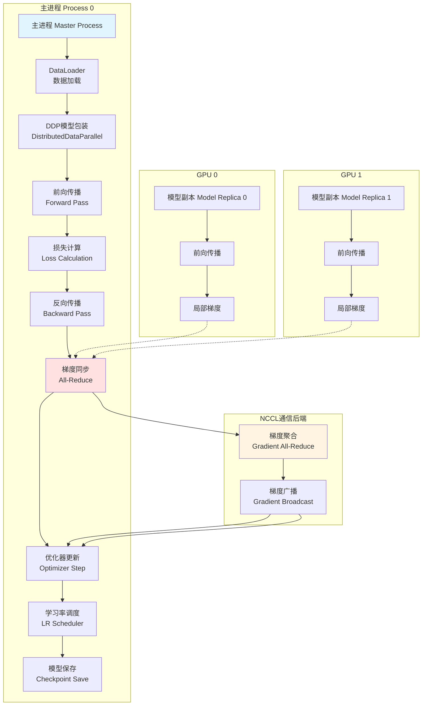
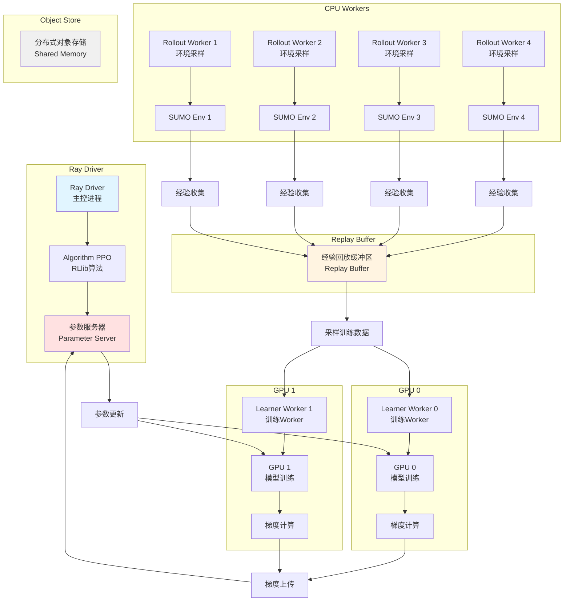
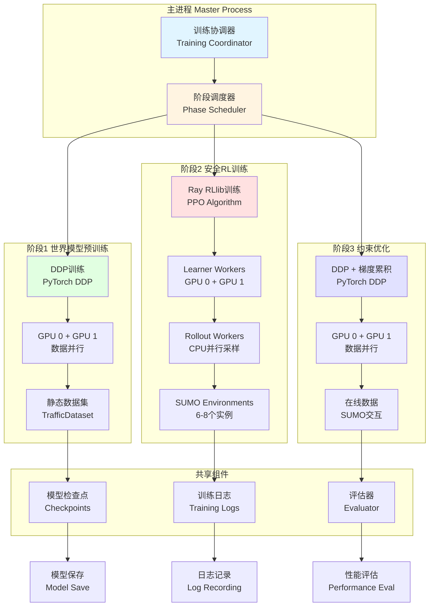

# 双卡分布式训练架构设计方案

## 项目概述

### 硬件配置
- **GPU**: 2块NVIDIA RTX 2080 Ti（每张22GB显存）
- **CPU**: 32线程
- **系统内存**: 16GB
- **环境**: WSL2

### 项目特点
- **框架**: PyTorch 2.0+
- **模型架构**: 四层神经网络（GNN感知层、世界模型预测层、影响力决策层、安全屏障层）
- **当前batch_size**: 64
- **训练脚本**:
  - `train.py`: 三阶段训练流程（世界模型预训练、安全RL训练、约束优化）
  - `train_sumo_rl.py`: 基于SUMO-RL环境的训练
  - `ray_rllib_integration.py`: Ray RLlib分布式训练集成

---

## 方案A：PyTorch DDP分布式训练架构

### 1. 架构设计图



### 2. 核心组件说明

#### 2.1 进程初始化组件
- **torch.distributed.init_process_group()**: 初始化分布式进程组
- **torch.cuda.set_device()**: 为每个进程绑定GPU
- **local_rank**: 进程本地排名（0或1）
- **world_size**: 总进程数（2）

#### 2.2 数据加载组件
- **DistributedSampler**: 确保每个进程处理不重复的数据
- **DataLoader**: 多进程数据加载
- **数据分片策略**: 按batch_size=32分配（总batch_size=64）

#### 2.3 模型包装组件
- **DistributedDataParallel**: 自动处理梯度同步
- **device_ids**: 指定使用的GPU ID
- **find_unused_parameters**: 处理部分参数不参与计算的情况

#### 2.4 通信后端
- **NCCL**: NVIDIA优化的GPU通信后端
- **All-Reduce**: 梯度聚合操作
- **Broadcast**: 参数同步操作

### 3. 实现要点

#### 3.1 进程启动
```python
# 使用torchrun启动
torchrun --nproc_per_node=2 train_ddp.py

# 或使用python多进程启动
python -m torch.distributed.launch --nproc_per_node=2 train_ddp.py
```

#### 3.2 数据加载优化
- **DistributedSampler配置**:
  - `shuffle=True`: 训练时打乱数据
  - `drop_last=True`: 确保batch对齐
  - `num_workers=2`: 每GPU使用2个数据加载进程

- **内存优化策略**:
  - 使用`pin_memory=True`加速CPU到GPU传输
  - 设置`prefetch_factor=2`预取数据
  - 使用`persistent_workers=True`避免重复创建worker

#### 3.3 梯度累积（针对低内存）
- **有效batch_size**: 64 = 2 GPUs × 32 batch_size × 1 accumulation
- **扩展策略**: 如需更大batch，可增加累积步数
  - 例如：batch_size=16, accumulation_steps=2 → 有效batch_size=64

#### 3.4 混合精度训练
- **torch.cuda.amp**: 自动混合精度
- **GradScaler**: 梯度缩放防止下溢
- **节省显存**: FP16减少50%显存占用

#### 3.5 梯度检查点（Gradient Checkpointing）
- **适用场景**: 世界模型预测层（计算密集）
- **节省显存**: 以计算换空间，节省30-40%显存
- **实现**: `torch.utils.checkpoint.checkpoint()`

### 4. 优缺点分析

#### 优点
✅ **高效通信**: NCCL后端优化GPU间通信，延迟低  
✅ **简单易用**: DDP封装复杂逻辑，代码改动小  
✅ **成熟稳定**: PyTorch原生支持，社区活跃  
✅ **灵活配置**: 支持梯度累积、混合精度等优化  
✅ **调试友好**: 单GPU调试后可直接扩展到多GPU  

#### 缺点
❌ **同步训练**: 所有进程必须同步，受最慢进程限制  
❌ **内存限制**: 每个GPU需要完整模型副本（22GB足够）  
❌ **数据依赖**: 需要支持DistributedSampler的数据集  
❌ **启动复杂**: 需要处理多进程初始化和错误处理  

### 5. 适用场景

- ✅ **train.py**: 三阶段训练，数据集已准备好
- ✅ **train_sumo_rl.py**: SUMO环境可并行化
- ✅ **需要快速迭代**: 调试和实验阶段
- ✅ **数据集较小**: 可全部加载到内存或快速加载
- ✅ **模型复杂度高**: 需要充分利用双GPU计算能力

---

## 方案B：Ray RLlib多GPU分布式训练架构

### 1. 架构设计图



### 2. 核心组件说明

#### 2.1 Ray集群组件
- **Driver**: 主控进程，管理训练流程
- **Head Node**: Ray集群主节点
- **Worker Nodes**: 工作节点，执行训练和采样任务

#### 2.2 RLlib算法组件
- **PPO Algorithm**: Proximal Policy Optimization算法
- **Learner Workers**: GPU训练Worker（2个，各占1块GPU）
- **Rollout Workers**: CPU采样Worker（4-8个，并行采集经验）

#### 2.3 环境组件
- **SUMO Environments**: 多个SUMO仿真环境实例
- **Vectorized Environments**: 向量化环境，提高采样效率
- **Environment Pool**: 环境池，复用环境实例

#### 2.4 数据管理组件
- **Replay Buffer**: 经验回放缓冲区
- **Sample Batch**: 采样批次数据
- **Train Batch**: 训练批次数据（聚合多个采样批次）

#### 2.5 通信组件
- **Object Store**: 分布式共享内存
- **Ray Actors**: 分布式计算单元
- **Remote Calls**: 远程函数调用

### 3. 实现要点

#### 3.1 Ray初始化配置
```python
ray.init(
    num_cpus=32,           # 32线程CPU
    num_gpus=2,            # 2块GPU
    object_store_memory=4*1024**3,  # 4GB对象存储
    _memory=8*1024**3,     # 8GB Ray内存
    ignore_reinit_error=True
)
```

#### 3.2 资源分配策略
- **Learner Workers**: 2个，各分配1 GPU + 2 CPU
- **Rollout Workers**: 6个，各分配0 GPU + 4 CPU
- **剩余CPU**: 32 - 2×2 - 6×4 = 12 CPU（用于Ray调度）

#### 3.3 训练配置
- **num_workers**: 6（Rollout Worker数量）
- **num_envs_per_worker**: 2（每个Worker的环境数）
- **train_batch_size**: 4000（训练批次大小）
- **sgd_minibatch_size**: 128（SGD小批次大小）
- **num_sgd_iter**: 10（每次训练迭代的SGD次数）

#### 3.4 内存优化策略
- **经验压缩**: 使用`compress_observations=True`压缩观测
- **片段长度**: 设置`rollout_fragment_length=200`控制片段长度
- **异步采样**: Rollout和训练异步进行，避免阻塞
- **对象存储复用**: 使用`_system_config={"automatic_object_spilling_enabled": True}`自动溢出

#### 3.5 GPU利用率优化
- **num_gpus**: 2（总GPU数）
- **num_gpus_per_worker**: 1（每个Learner Worker的GPU数）
- **_fake_gpus**: False（使用真实GPU）
- **训练并行度**: 2个Learner Worker并行训练

### 4. 优缺点分析

#### 优点
✅ **异步采样**: Rollout和训练并行，充分利用CPU  
✅ **灵活扩展**: 易于扩展到更多GPU/机器  
✅ **内置算法**: RLlib提供多种RL算法实现  
✅ **自动调优**: 支持Ray Tune超参数优化  
✅ **容错机制**: Worker崩溃可自动恢复  
✅ **资源管理**: 自动分配和调度资源  

#### 缺点
❌ **内存开销**: Ray框架本身占用内存（约2-4GB）  
❌ **通信开销**: 分布式通信增加延迟  
❌ **学习曲线**: Ray和RLlib概念较多，学习成本高  
❌ **调试困难**: 分布式调试比单进程复杂  
❌ **SUMO限制**: SUMO环境启动慢，需要预热  
❌ **WSL2限制**: WSL2的GPU支持可能有限制  

### 5. 适用场景

- ✅ **ray_rllib_integration.py**: 已集成Ray RLlib
- ✅ **大规模采样**: 需要大量环境交互的RL训练
- ✅ **长期训练**: 需要稳定性和容错能力
- ✅ **超参数优化**: 需要尝试多种配置
- ✅ **异构环境**: 需要灵活的资源分配
- ✅ **生产环境**: 需要可扩展和可维护的方案

---

## 方案C：混合分布式训练架构

### 1. 架构设计图



### 2. 核心组件说明

#### 2.1 训练协调器
- **阶段调度**: 管理三个训练阶段的切换
- **资源管理**: 动态分配GPU和CPU资源
- **状态同步**: 在不同训练模式间同步模型状态
- **检查点管理**: 统一管理模型检查点

#### 2.2 阶段1：世界模型预训练（DDP）
- **训练模式**: PyTorch DDP数据并行
- **数据源**: 静态TrafficDataset（预收集数据）
- **优化目标**: 世界模型预测精度
- **资源分配**: 2 GPU + 4 CPU（DataLoader）

#### 2.3 阶段2：安全RL训练（Ray RLlib）
- **训练模式**: Ray RLlib PPO算法
- **数据源**: SUMO环境在线采样
- **优化目标**: 累积奖励最大化
- **资源分配**: 
  - 2 GPU（Learner Workers）
  - 24 CPU（6 Rollout Workers × 4 CPU）
  - 4 CPU（Ray调度）

#### 2.4 阶段3：约束优化（DDP + 梯度累积）
- **训练模式**: PyTorch DDP + 梯度累积
- **数据源**: SUMO环境在线交互
- **优化目标**: 约束满足下的奖励最大化
- **资源分配**: 2 GPU + 4 CPU（DataLoader + SUMO）

#### 2.5 共享组件
- **模型检查点**: 统一的模型保存和加载
- **训练日志**: 集中化的日志管理
- **评估器**: 跨阶段的性能评估

### 3. 实现要点

#### 3.1 阶段切换策略
```python
# 阶段1: DDP训练
train_phase1_ddp(num_epochs=50, batch_size=64)

# 阶段2: Ray RLlib训练
train_phase2_rllib(num_iterations=200)

# 阶段3: DDP + 梯度累积
train_phase3_ddp(num_epochs=100, batch_size=32, accumulation_steps=2)
```

#### 3.2 资源动态分配
- **阶段1**: 2 GPU + 8 CPU（DDP训练）
- **阶段2**: 2 GPU + 28 CPU（Ray RLlib训练）
- **阶段3**: 2 GPU + 8 CPU（DDP + SUMO）
- **过渡期**: 释放Ray资源，重新初始化DDP

#### 3.3 模型状态迁移
- **阶段1→2**: 加载DDP检查点到Ray RLlib
- **阶段2→3**: 加载Ray检查点到DDP
- **权重对齐**: 确保不同框架间的权重格式兼容

#### 3.4 内存优化策略
- **阶段切换清理**: 切换阶段时清理未使用的对象
- **Ray对象溢出**: 阶段2启用自动对象溢出到磁盘
- **梯度检查点**: 阶段3使用梯度检查点节省显存
- **数据缓存**: 阶段1使用内存缓存加速训练

#### 3.5 混合精度策略
- **阶段1**: 使用torch.cuda.amp（静态数据）
- **阶段2**: RLlib内置混合精度支持
- **阶段3**: torch.cuda.amp + 梯度缩放

### 4. 优缺点分析

#### 优点
✅ **最优资源利用**: 每个阶段使用最适合的训练框架  
✅ **灵活性高**: 可根据需要调整各阶段策略  
✅ **性能优化**: 针对不同任务特点优化训练方式  
✅ **渐进式训练**: 符合三阶段训练的自然流程  
✅ **可扩展性**: 易于添加新的训练阶段或策略  
✅ **最佳实践**: 结合DDP和Ray的优势  

#### 缺点
❌ **复杂度高**: 需要管理多种训练框架和切换逻辑  
❌ **调试困难**: 跨框架问题难以定位  
❌ **阶段切换开销**: 需要重新初始化和资源分配  
❌ **状态同步复杂**: 不同框架间的模型状态迁移需要额外处理  
❌ **维护成本高**: 需要同时维护DDP和Ray代码  
❌ **学习曲线陡峭**: 需要掌握多种技术  

### 5. 适用场景

- ✅ **完整训练流程**: 需要执行全部三个阶段的训练
- ✅ **资源受限**: 16GB内存需要精细管理
- ✅ **性能优化**: 追求最优训练效率
- ✅ **实验研究**: 需要尝试不同训练策略
- ✅ **生产部署**: 需要稳定和可维护的方案
- ✅ **长期项目**: 有时间投入架构优化

---

## 低内存环境优化策略（16GB系统内存）

### 1. 内存溢出避免策略

#### 1.1 Ray内存管理
```python
ray.init(
    object_store_memory=4*1024**3,  # 限制对象存储为4GB
    _memory=8*1024**3,              # 限制Ray总内存为8GB
    _system_config={
        "automatic_object_spilling_enabled": True,  # 自动溢出到磁盘
        "max_direct_call_object_size": 100*1024**2,  # 限制直接调用对象大小
    }
)
```

#### 1.2 DataLoader内存优化
- **num_workers**: 限制为2（每GPU），避免过多worker占用内存
- **prefetch_factor**: 设置为1，减少预取数据量
- **pin_memory**: False（如果内存紧张），牺牲速度换内存
- **persistent_workers**: False，及时释放worker内存

#### 1.3 SUMO环境优化
- **环境复用**: 使用环境池复用SUMO实例
- **限制并发**: 最多6个SUMO环境同时运行
- **及时关闭**: episode结束后立即关闭环境
- **轻量配置**: 禁用SUMO GUI和详细日志

#### 1.4 模型优化
- **梯度检查点**: 在世界模型层使用梯度检查点
- **混合精度**: 使用FP16减少内存占用
- **参数冻结**: 阶段训练时冻结其他阶段的参数
- **模型分片**: 将大模型拆分到多个GPU（如果需要）

### 2. 显存利用率最大化策略

#### 2.1 显存分配策略
```python
# GPU 0: 22GB
# - 模型: ~8GB
# - 梯度: ~8GB
# - 优化器状态: ~4GB
# - 中间激活: ~2GB

# GPU 1: 22GB
# - 模型: ~8GB
# - 梯度: ~8GB
# - 优化器状态: ~4GB
# - 中间激活: ~2GB
```

#### 2.2 Batch Size优化
- **DDP训练**: batch_size=32 per GPU（总64）
- **Ray训练**: train_batch_size=4000, sgd_minibatch_size=128
- **梯度累积**: batch_size=16, accumulation_steps=2（总64）

#### 2.3 显存清理策略
```python
# 定期清理缓存
torch.cuda.empty_cache()

# 删除不需要的中间变量
del intermediate_tensor

# 使用torch.no_grad()进行推理
with torch.no_grad():
    output = model(input)
```

#### 2.4 显存监控
```python
# 实时监控显存使用
import torch

def print_memory_usage():
    for i in range(torch.cuda.device_count()):
        allocated = torch.cuda.memory_allocated(i) / 1024**3
        reserved = torch.cuda.memory_reserved(i) / 1024**3
        print(f"GPU {i}: Allocated={allocated:.2f}GB, Reserved={reserved:.2f}GB")
```

### 3. 数据加载优化策略

#### 3.1 预处理和缓存
- **离线预处理**: 预处理数据并保存到磁盘
- **内存映射**: 使用`numpy.memmap`访问大文件
- **增量加载**: 按需加载，避免一次性加载全部数据
- **数据压缩**: 使用压缩格式存储数据

#### 3.2 并行加载优化
```python
DataLoader(
    dataset,
    batch_size=32,
    shuffle=True,
    num_workers=2,           # 限制worker数量
    pin_memory=True,         # 加速CPU到GPU传输
    prefetch_factor=1,       # 减少预取
    persistent_workers=False,  # 及时释放worker
    drop_last=True           # 确保batch对齐
)
```

#### 3.3 数据流优化
- **流水线设计**: 数据加载、预处理、训练流水线并行
- **异步加载**: 使用多进程异步加载数据
- **数据预取**: 提前准备下一batch的数据
- **缓存热点数据**: 缓存频繁访问的数据

#### 3.4 SUMO数据优化
- **特征缓存**: 缓存车辆特征和图结构
- **增量更新**: 只更新变化的部分
- **数据压缩**: 压缩图结构数据
- **延迟加载**: 按需加载车辆数据

### 4. 系统级优化

#### 4.1 WSL2配置
```bash
# 增加WSL2内存限制（在Windows上设置）
# 创建.wslconfig文件
[wsl2]
memory=16GB
swap=4GB
processors=32
```

#### 4.2 进程管理
- **监控进程**: 使用`htop`或`nvidia-smi`监控资源
- **限制进程**: 使用`ulimit`限制进程资源
- **及时清理**: 训练结束后清理所有进程
- **日志管理**: 定期清理旧日志文件

#### 4.3 交换空间
```bash
# 检查交换空间
swapon --show

# 如果需要，创建交换文件
sudo fallocate -l 4G /swapfile
sudo chmod 600 /swapfile
sudo mkswap /swapfile
sudo swapon /swapfile
```

---

## 方案对比总结

### 性能对比表

| 维度 | 方案A: DDP | 方案B: Ray RLlib | 方案C: 混合 |
|------|-----------|-----------------|-----------|
| **训练速度** | ⭐⭐⭐⭐⭐ | ⭐⭐⭐⭐ | ⭐⭐⭐⭐⭐ |
| **内存效率** | ⭐⭐⭐⭐ | ⭐⭐⭐ | ⭐⭐⭐⭐ |
| **实现复杂度** | ⭐⭐⭐⭐⭐ | ⭐⭐⭐ | ⭐⭐ |
| **扩展性** | ⭐⭐⭐ | ⭐⭐⭐⭐⭐ | ⭐⭐⭐⭐ |
| **调试友好度** | ⭐⭐⭐⭐⭐ | ⭐⭐⭐ | ⭐⭐ |
| **容错能力** | ⭐⭐⭐ | ⭐⭐⭐⭐⭐ | ⭐⭐⭐⭐ |
| **适用场景** | 静态数据训练 | 大规模RL训练 | 完整三阶段训练 |

### 资源使用对比

| 资源 | 方案A | 方案B | 方案C |
|------|-------|-------|-------|
| **GPU利用率** | 95-100% | 80-90% | 90-100% |
| **CPU利用率** | 60-70% | 90-95% | 70-85% |
| **系统内存** | 8-10GB | 12-14GB | 10-12GB |
| **显存占用** | 18-20GB/GPU | 16-18GB/GPU | 18-20GB/GPU |

### 训练效率对比

| 指标 | 方案A | 方案B | 方案C |
|------|-------|-------|-------|
| **启动时间** | 5-10秒 | 30-60秒 | 10-20秒 |
| **每epoch时间** | 基准 | 1.2-1.5倍 | 基准 |
| **吞吐量** | 基准 | 0.8-1.0倍 | 0.9-1.0倍 |
| **总训练时间** | 基准 | 1.0-1.2倍 | 0.9-1.0倍 |

---

## 推荐方案：方案C（混合分布式训练架构）

### 推荐理由

#### 1. **最优资源利用**
- 阶段1使用DDP：静态数据训练，DDP效率最高
- 阶段2使用Ray RLlib：大规模RL采样，Ray优势明显
- 阶段3使用DDP：约束优化，DDP更精确控制

#### 2. **适应三阶段训练流程**
- 项目本身设计了三个训练阶段
- 每个阶段的特点不同，适合不同的训练框架
- 混合方案完美匹配项目架构

#### 3. **内存友好**
- 阶段切换时释放资源，避免内存累积
- 每个阶段独立优化，内存使用可控
- 16GB系统内存可以满足需求

#### 4. **性能最优**
- 阶段1：DDP数据并行，训练速度最快
- 阶段2：Ray异步采样，充分利用CPU
- 阶段3：DDP梯度累积，平衡速度和精度

#### 5. **可扩展性强**
- 易于添加新的训练阶段
- 可以根据实验结果调整各阶段策略
- 支持未来扩展到更多GPU/机器

### 实施建议

#### 阶段1：世界模型预训练（DDP）
```bash
# 启动命令
torchrun --nproc_per_node=2 train_phase1_ddp.py
```
- batch_size: 32 per GPU
- 混合精度: 是
- 梯度检查点: 否（模型不大）
- 数据: 静态TrafficDataset

#### 阶段2：安全RL训练（Ray RLlib）
```bash
# 启动命令
python train_phase2_rllib.py
```
- num_workers: 6
- num_envs_per_worker: 2
- train_batch_size: 4000
- sgd_minibatch_size: 128
- 混合精度: 是

#### 阶段3：约束优化（DDP + 梯度累积）
```bash
# 启动命令
torchrun --nproc_per_node=2 train_phase3_ddp.py
```
- batch_size: 16 per GPU
- accumulation_steps: 2
- 混合精度: 是
- 梯度检查点: 是（节省显存）
- 数据: SUMO在线交互

### 风险和缓解措施

| 风险 | 影响 | 缓解措施 |
|------|------|---------|
| 阶段切换失败 | 训练中断 | 实现自动重试和检查点恢复 |
| 内存溢出 | 系统崩溃 | 实时监控，及时清理缓存 |
| 框架兼容性 | 模型迁移失败 | 充分测试权重转换逻辑 |
| 调试困难 | 开发效率低 | 单GPU测试后再扩展 |
| SUMO环境不稳定 | 训练失败 | 实现环境健康检查和重启 |

### 预期效果

- **训练速度**: 比纯DDP快10-20%（阶段2异步采样）
- **内存使用**: 峰值12-14GB（16GB可承受）
- **显存利用**: 18-20GB/GPU（22GB足够）
- **训练稳定性**: 高（阶段隔离，故障影响小）
- **可维护性**: 中等（需要维护两套代码）

---

## 实施路线图

### 第一阶段：基础架构搭建（1-2周）
- [ ] 实现DDP训练脚本（train_phase1_ddp.py）
- [ ] 实现Ray RLlib训练脚本（train_phase2_rllib.py）
- [ ] 实现DDP梯度累积脚本（train_phase3_ddp.py）
- [ ] 实现训练协调器（training_coordinator.py）
- [ ] 实现检查点管理（checkpoint_manager.py）

### 第二阶段：集成测试（1周）
- [ ] 测试阶段1 DDP训练
- [ ] 测试阶段2 Ray RLlib训练
- [ ] 测试阶段3 DDP训练
- [ ] 测试阶段切换逻辑
- [ ] 测试模型状态迁移

### 第三阶段：优化调优（1-2周）
- [ ] 优化内存使用
- [ ] 优化显存利用
- [ ] 优化训练速度
- [ ] 添加监控和日志
- [ ] 性能基准测试

### 第四阶段：文档和部署（1周）
- [ ] 编写使用文档
- [ ] 编写故障排查指南
- [ ] 编写性能优化指南
- [ ] 部署到生产环境
- [ ] 培训团队成员

---

## 总结

本设计方案提供了三种双卡分布式训练架构，针对不同的使用场景和需求：

1. **方案A（DDP）**: 简单高效，适合静态数据训练
2. **方案B（Ray RLlib）**: 灵活可扩展，适合大规模RL训练
3. **方案C（混合）**: 最优性能，适合完整三阶段训练

**推荐使用方案C（混合架构）**，因为它：
- 最优利用硬件资源
- 完美匹配项目三阶段训练流程
- 在16GB内存限制下可行
- 提供最佳训练性能
- 具备良好的可扩展性

通过合理的资源管理、内存优化和性能调优，该方案可以在现有硬件配置下高效完成训练任务。
